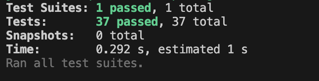

SPANISH V.

## 🌸 Descripción

Este proyecto forma parte de una serie de sprints realizados en IT Academy - Barcelona Activa.

Este Sprint corresponde al 03.1.

Objetivos: 
- Comprender y practicar métodos: Map, reduce y filter.
- Crear pruebas unitarias.
- Aprender a manipular un conjunto de datos.




## 💻 Tecnologias usadas

- Javascript Vanilla
- jest: 29.2.2

## ⚙️ Instalación

Para instalarlo en la computadora, debes seguir estos pasos:

1. Clona el repositorio

```bash
https://github.com/ImLauraGS/javascript_II.git
``` 
2. Instalar dependencias.

```bash
npm install
``` 
3. Correr los tests.

```bash
npm test
``` 

## 🔗 Autora

 
Laura G. 
[LinkedIn](https://www.linkedin.com/in/laura-gil-solano/)


_______________________________________________________________________

ENGLISH V.

## 🌸 Description

 This project is part of a series of sprints carried out at IT Academy - Barcelona Activa.
 This Sprint corresponds to 03.1.
 
 Objectives:
- Understanding and practicing methods: Map, reduce, and filter.
- Creating Unit Tests.
- Learning to manipulate a dataset.


 

## 💻 Technologies Used

- Javascript Vanilla
- jest: 29.2.2


## ⚙️ Installation
 To install it on your computer, follow these steps:

 1. Clone the repository

 ```bash
https://github.com/ImLauraGS/e-commerce_JS.git
``` 

2. Install dependencies.

```bash
npm install
``` 

3. Run the tests.


```bash
npm test
``` 
 
## 🔗 Author
  
 Laura G. 
 [LinkedIn](https://www.linkedin.com/in/laura-gil-solano/)